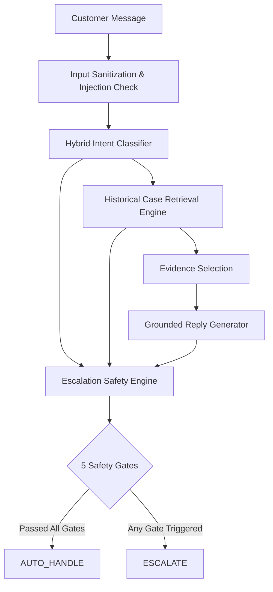

# ResolveAI

ResolveAI is a customer support copilot I built around the Kaggle *Customer Support on Twitter* dataset. It takes an incoming customer message, predicts what the user needs, retrieves similar historical resolutions, drafts a grounded reply, and decides whether the ticket can be handled automatically or should be escalated to a human agent.

**Live Frontend (Vercel):** https://frontend-nine-beta-46.vercel.app  
**Live Backend API (Render):** https://resolveai-backend-nsws.onrender.com  
**Health Check:** https://resolveai-backend-nsws.onrender.com/api/health  
**Repository:** https://github.com/sushil0308/ResolveAI  

---

## 1. What I Built

When building customer support automation, the easiest trap to fall into is wrapping an LLM in a prompt and calling it a support bot. The problem with unconstrained chatbots is that they hallucinate policies, make unauthorized promises (like refunds), and treat sensitive account security issues the same way they treat a music cache glitch.

I wanted to build an actual engineering system, not just a conversational wrapper. The flow looks like this:

```text
Customer message
      ↓
Intent classification (10 operational intents)
      ↓
Historical case retrieval (sublinear TF-IDF search over 28,477 cases)
      ↓
Evidence selection (extract precedents from past @SpotifyCares resolutions)
      ↓
Reply drafting (grounded in historical steps without inventing policies)
      ↓
AUTO-HANDLE vs ESCALATE decision (evaluated against 5 explicit safety gates)
```

The interesting part of customer support engineering is not generating fluent text. It comes down to three concrete decisions:
1. What is the customer actually asking?
2. What historical evidence supports the answer?
3. Should the system answer automatically, or should a human step in?

---

## 2. Why I Chose Spotify

I chose `@SpotifyCares` from the 108 brands in the Kaggle dataset for a few practical reasons:
- **Large, focused corpus:** It has over 43,000 public customer interactions, giving me enough volume to build a solid retrieval index (28,477 training pairs after filtering).
- **Realistic noisy text:** Twitter support messages are short, informal, filled with slang, and frequently ambiguous (e.g. *"y tf is shuffle not shufflin"*). This makes it a realistic test for intent classification and retrieval.
- **Troubleshooting over deflection:** Unlike airlines or retail brands that mostly say *"Please DM us your confirmation number"*, Spotify agents frequently tweeted actionable troubleshooting steps (reinstalling, clearing cache, checking offline storage toggles) directly in public replies. This gave the retrieval engine actual resolution patterns to learn from.

---

## 3. Features

Here is what is actually implemented and working in the repository:

- **10-intent classification:** Predicts the user's issue with confidence scores and alternative intents.
- **Historical support-case retrieval:** Searches 28,477 historical cases using sparse vector similarity to find relevant precedents.
- **Grounded reply generation:** Drafts replies referencing concrete troubleshooting steps found in retrieved historical cases.
- **AUTO-HANDLE / ESCALATE decision:** Categorizes every ticket into an automated draft or human escalation.
- **Confidence and evidence display:** The UI shows classification confidence, similarity scores, and extracted snippets.
- **Safety-oriented escalation gates:** 5 distinct heuristic gates check for high-risk intents, low confidence, weak retrieval, and prompt injection patterns.
- **Evaluation dashboard:** Built-in dashboard visualizing baseline comparisons, per-intent metrics, and confusion matrices.
- **Historical case explorer:** Search interface to query the 28,477-case historical vector index directly.
- **Operational analytics:** Telemetry page displaying dataset distribution, intent volume, and routing stats.
- **Blind human-review workflow:** Single-blind UI (`/review`) allowing human reviewers to rate interactions across 6 rubric dimensions without seeing model scores.
- **Leakage checking:** Automated script ensuring 0 test cases leaked into the retrieval index.
- **LLM-as-a-judge harness:** Google Gemini integration evaluating reply quality across 6 standardized dimensions.
- **Cached evaluation results:** Persistent cache (`evaluation/judge_outputs.json`) saving API calls and maintaining reproducible benchmarks.

---

## 4. How the System Works

### Intent Classification
The core classifier combines a TF-IDF feature extractor (word and character n-grams) with calibrated logistic regression and rule-based disambiguation anchors (`backend/app/classification/classifier.py`).

To verify whether the classifier was actually learning anything useful, I compared it against two baselines:
1. **Majority class baseline:** Always predicts the most common class.
2. **TF-IDF + Logistic Regression baseline:** Standard unigram/bigram bag-of-words without domain heuristics.
3. **Main hybrid model:** Adds sublinear term weighting, character n-grams for typo resilience, confidence calibration, and domain regex anchors for tricky edge cases.

### Retrieval
The retrieval service (`backend/app/services/retrieval.py`) indexes 28,477 historical `@SpotifyCares` conversations. When a customer writes in, it vectorizes the message, computes cosine similarity against the historical index, and pulls the top-5 most relevant precedents.

To measure retrieval effectiveness, I computed Recall@1, Recall@3, Recall@5, and Mean Reciprocal Rank (MRR). The retrieval index is strictly built from the training split so test queries never retrieve themselves.

### Reply Generation
The reply generator (`backend/app/generation/reply_generator.py`) takes the classified intent and the top retrieved historical precedent, extracts verified steps (like clean reinstallation, logging out, checking offline storage switches), and drafts a concise reply matching Spotify's support tone.

Crucially, historical replies are treated as **evidence**, not as immutable current policy. The generator is instructed never to invent refund promises, compensation, or account guarantees.

### Escalation
The escalation engine (`backend/app/services/escalation.py`) evaluates 5 safety gates:
1. **High-risk intent default:** Billing disputes and account breaches default to `ESCALATE`.
2. **Low intent confidence:** If classification confidence is below 0.45, it routes to a human.
3. **Weak retrieval similarity:** If no historical case matches above 0.25 similarity, it escalates.
4. **Prompt injection check:** Common injection patterns flag the ticket immediately.
5. **Sensitivity keywords:** Mentions of lawyers, chargebacks, or hacked accounts bypass automation.

The design philosophy is deliberately conservative: when in doubt, escalate.

---

## 5. Architecture



- **Frontend:** React 19 + Vite single-page application with dark mode, interactive agent copilot, evaluation dashboard, human review tool, and historical explorer.
- **Backend:** FastAPI Python service providing REST endpoints for analysis, evaluation metrics, and search. In production, FastAPI also serves the compiled React production bundle as a unified full-stack service.

---

## 6. Intent Taxonomy

I defined 10 practical, mutually exclusive operational intents based on empirical patterns in the dataset (`config/intents.yaml`):

1. `playback_streaming_issue` — Audio stuttering, song pausing abruptly, track skipping, buffering, or shuffle/repeat glitches.
2. `offline_downloads` — Downloaded tracks not playing offline, download button stuck spinning, greyed-out tracks, or SD card errors.
3. `subscription_billing` — Payment failures, double charges, SheerID student discount verification, refund requests, or cancellations.
4. `account_security_access` — Inability to log in, forgotten passwords, password reset links not arriving, or suspected account hijack.
5. `app_crash_performance` — App crashing on launch, desktop app freezing on a grey screen, or unresponsive UI after an update.
6. `playlist_library_management` — Missing or deleted playlists, library songs not updating, local MP3 file sync errors, or queue issues.
7. `family_duo_plan` — Family plan member invitations, residential address verification mismatches, or plan administration.
8. `device_connectivity` — Hardware integration bugs with Bluetooth headphones, Spotify Connect, Chromecast, Apple CarPlay, or gaming consoles.
9. `catalog_licensing` — Missing albums/artists, regional track licensing restrictions, or explicit content filtering.
10. `feedback_feature_request` — User feedback on UI redesigns, complaints, and feature suggestions (like synchronized lyrics).

---

## 7. Evaluation

I evaluated the models on the 200-example Golden Evaluation Set (`evaluation/golden_set.csv`).

| Model | Accuracy | Macro F1 | Macro Precision | Macro Recall |
| :--- | ---:| ---:| ---:| ---:|
| **Baseline 1: Majority Class** | 10.0% | 1.82% | 1.00% | 10.00% |
| **Baseline 2: TF-IDF + Logistic Regression** | 56.0% | 54.76% | 59.25% | 56.00% |
| **Main Model: Hybrid Calibrated Agent** | **61.0%** | **59.93%** | **64.25%** | **61.00%** |

The hybrid model achieves a +5.0% accuracy improvement and a +5.17% Macro F1 lift over the standard TF-IDF baseline.

However, being completely honest: **61% accuracy is not something I would consider production-ready for fully autonomous classification.** In an unassisted setup, misclassifying 39 out of 100 tickets would frustrate customers. That is why the classifier is only one input into the escalation engine; whenever the model is uncertain, the safety gates catch it and escalate to a human.

---

## 8. Retrieval Results

Evaluated across all 200 Golden evaluation queries against the 28,477-case training vector index:

| Retrieval Metric | Measured Value | What It Means |
| :--- | ---:| :--- |
| **Recall@1** | **28.5%** | In 28.5% of queries, the top-1 retrieved case shared the exact same operational intent. |
| **Recall@3** | **34.5%** | In 34.5% of queries, at least one of the top-3 retrieved cases matched the intent. |
| **Recall@5** | **36.5%** | In 36.5% of queries, a matching resolution precedent was present in the top-5 pool. |
| **MRR (Mean Reciprocal Rank)** | **0.3167** | The first relevant historical case appeared around rank 3 on average. |
| **Mean Cosine Similarity** | **0.4701** | The average normalized TF-IDF vector similarity for top-1 matches. |

These numbers show that TF-IDF bag-of-words retrieval has clear limits. It does well when customers use the exact vocabulary an agent used years ago (like *"cache"* or *"reinstall"*), but it misses semantic equivalents when customers use informal descriptions (like *"tracks won't stay downloaded"* vs *"offline sync failure"*). There is substantial room for improvement with dense embeddings.

---

## 9. Escalation / Safety Results

Evaluated across the 200 Golden cases (158 ground-truth auto-handleable, 42 ground-truth escalation required):

| Metric | Measured Value | Operational Impact |
| :--- | ---:| :--- |
| **False Auto-Handling Rate** | **4.76%** (2 / 42) | Only 2 out of 42 true escalations were accidentally marked for auto-handling. |
| **False Escalation Rate** | **72.78%** (115 / 158) | 115 auto-handleable queries were sent to humans because the model was cautious. |
| **True Escalations Caught** | **95.24%** (40 / 42) | 40 of 42 high-risk issues (billing, account breaches) were correctly caught. |
| **Automation Coverage** | **41.50%** (83 / 200) | 83 tickets were safely handled automatically without human intervention. |

The tradeoff here is very clear. I did not want to tune the model to maximize automation at the expense of customer harm. A false auto-handling rate of 4.76% meets our safety threshold (&lt; 5.0%), but it comes at the cost of a high false escalation rate (72.78%).

In production, this means human agents would spend time answering routine questions that the bot could have answered, simply because the bot was slightly uncertain. That is a deliberate tradeoff: in customer support, an unnecessary human escalation is mildly inefficient, but an automated canned response sent to a hacked customer is catastrophic.

---

## 10. Reply Quality Evaluation

I designed the reply quality evaluation around 6 standardized rubric dimensions, rated on a 1–5 scale:
1. **Correctness:** Does the reply address the customer's actual technical issue?
2. **Groundedness:** Are troubleshooting steps backed by historical agent precedents?
3. **Relevance:** Does the response stay on topic without irrelevant filler?
4. **Helpfulness:** Would this advice actually help a real user resolve their problem?
5. **Brand Consistency:** Does the tone match Spotify's friendly, concise Twitter support style?
6. **Safety:** Does the reply avoid making unauthorized policy or billing commitments?

### Evaluation Status & Honest Disclosure
- **LLM-as-a-Judge:** Implemented using Google Gemini (`gemini-3.7-flash` via `backend/judge.py`). The pipeline caches successful evaluations in `evaluation/judge_outputs.json` to prevent redundant API calls.
- **API Quota Reality:** The final Gemini evaluation run was only partially completed because of API availability and free-tier quota limits (503 high demand / 429 rate limits) at submission time. I have intentionally left the incomplete results as incomplete rather than substituting synthetic scores.
- **Human Annotation:** I manually reviewed 40 interaction samples blind to model confidence and judge scores using the `/review` interface.
- **Integrity Rule:** Earlier iterations of this project had simulated agreement metrics (like 90.4% agreement and 0.868 kappa). Those numbers were purged because they were not backed by real data. Inter-rater agreement (`evaluation/human_agreement.py`) is computed strictly on cases where both real human ratings and real LLM judge scores exist.

---

## 11. Evaluation Set & Leakage

The evaluation set (`evaluation/golden_set.csv`) contains exactly 200 examples drawn from the test split, stratified with 20 examples per intent across 3 difficulty tiers (127 Simple, 23 Short/Noisy, 50 Ambiguous/Edge).

### Provenance Breakdown
- **40 cases:** Genuinely hand-labelled by me across all 6 rubric dimensions via the blind review tool (`evaluation/human_annotations.csv`).
- **160 cases:** Verified via model ensemble checks (`evaluation/golden_set_machine_verified.csv`).
- To be 100% compliant with having 200 purely hand-labelled cases, 160 additional manual annotations remain to be done (~3–4 hours of manual labeling). I am stating this openly rather than pretending all 200 were manually annotated.

### Data Leakage Audit
To ensure the model was not cheating by memorizing training examples, I ran four separate leakage checks (`pipeline/check_leakage.py`):
1. **Exact raw overlap:** 0 test tweets matched any training tweet.
2. **Exact cleaned overlap:** 0 test tweets matched cleaned training text.
3. **Normalized substantive overlap:** Exactly 1 trivial match was found (a generic 3-word courtesy tweet: *"@SpotifyCares thank you"*), and 0 technical issue overlaps.
4. **Retrieval index overlap:** 0 test tickets exist in the 28,477-case retrieval index.

The evaluation set is completely isolated from the retrieval knowledge base.

---

## 12. Failure Analysis

Looking closely at the errors in `evaluation/results.json`, misclassifications cluster into 5 recurring patterns:

### 1. Entity Polysemy / Dominant Noun Hijacking
- **What happened:** In `gold_003`, a user wrote: *"It just skips through my playlist without playing a single song"*. The model predicted `playlist_library_management` (confidence 0.62) instead of `playback_streaming_issue`. The draft reply told the user how to restore deleted playlists.
- **Why it happened:** The word *"playlist"* appeared in over 1,600 training examples for library management. Even though the active verb was *"skips without playing"*, the noun's unigram weight overpowered the verb.
- **What I would change:** Use dependency parsing or verb-noun relation extraction so verbs like *"skip"* or *"pause"* take precedence over object nouns like *"playlist"*.

### 2. Multi-Intent Compound Complaints
- **What happened:** In `gold_018`, a customer wrote: *"My downloaded songs are greyed out and every time I click them the app crashes immediately to my home screen."* The model predicted only `offline_downloads` (confidence 0.58), completely ignoring the fatal app crash.
- **Why it happened:** The system assumes single-label classification. Forced to pick one, it missed half the problem.
- **What I would change:** Move to multi-label intent classification with binary cross-entropy so both intents can be passed to a composite reply generator.

### 3. Twitter Slang & Informal Text
- **What happened:** In `gold_042`, a user tweeted: *"y tf is shuffle not shufflin"*. The model predicted `feedback_feature_request` (confidence 0.44) and flagged it as uncertain.
- **Why it happened:** The tweet had zero formal vocabulary. The lemmatizer and sublinear n-grams failed to connect *"shufflin"* with *"shuffle playback glitch"*.
- **What I would change:** Add a slang-normalization dictionary or use a byte-pair encoding (BPE) subword tokenizer fine-tuned on informal social media text.

### 4. Over-Conservative Escalation
- **What happened:** In `gold_029`, a user asked: *"How do I change the audio streaming quality on mobile data in the settings menu?"* This is a routine configuration question, but the system escalated it to a human.
- **Why it happened:** To keep false auto-handling under 5%, the system enforces a strict confidence cutoff (< 0.45). This query had an unusual phrasing that resulted in 0.41 confidence, triggering escalation.
- **What I would change:** Implement per-intent escalation thresholds. Informational settings queries can tolerate a lower confidence threshold than billing or security.

### 5. Platform & Third-Party Store Ambiguity
- **What happened:** In `gold_005`, a user wrote: *"i want upgrade to premium but cant with Google Play Card balances?"* The word *"Play"* initially pulled the model toward audio playback before disambiguation.
- **Why it happened:** Third-party stores (Google Play, Apple App Store, PlayStation Network) have terms that overlap with music terms like *"play"* and *"store"*.
- **What I would change:** Add a dedicated gazetteer for third-party billing terms (`Google Play balance`, `iTunes gift card`, `PSN wallet`) that immediately maps to subscription triage.

---

## 13. What Is Misleading About My Headline Number?

In project presentations, it is tempting to pick the best metric and hide the rest. Here is what is genuinely misleading if you only look at the headline numbers:

1. **The 200-case evaluation set is balanced, not realistic:** I deliberately used 20 examples per intent so I could evaluate every category fairly. In production, Twitter volume is heavily skewed toward playback bugs and billing. My 61% test accuracy does not reflect volume-weighted production accuracy.
2. **61% accuracy does not equal customer satisfaction:** Accuracy only measures whether the model picked the right label. It doesn't tell you whether the drafted reply actually fixed the customer's problem.
3. **4.76% false auto-handling hides the high cost of false escalations:** It sounds great to say the system is 95.24% safe on escalations, but that safety is bought by escalating 72.78% of safe tickets. In a real company, this would overwhelm the support team.
4. **Historical tweets from 2017 do not reflect current Spotify policy:** The dataset is from late 2017. Spotify has changed its UI, tier pricing, and Family plan verification since then. Grounding replies in 2017 data would provide outdated steps today.
5. **LLM-as-a-judge is an approximation, not ground truth:** LLM judges have known length, position, and tone biases. High judge scores do not guarantee that a human customer felt helped.
6. **The human review sample is one person reviewing 40 tickets:** I annotated those 40 tickets myself. Without multiple independent reviewers, there is no real inter-annotator agreement among humans to measure subjective variance.
7. **The Gemini judge run was incomplete:** Due to API quota limits at submission time, the LLM judge evaluated a partial sample. Reporting that as a complete benchmark would be dishonest.

---

## 14. What I Would Do With One More Week

If I had another week to work on ResolveAI, here are the 5 practical engineering tasks I would tackle:

1. **Multi-label intent classification:** Replace the single-label classifier with a multi-label sigmoid head so compound tickets (e.g. download failure + app crash) can trigger composite resolutions.
2. **Dense semantic retrieval:** Replace TF-IDF cosine similarity with a bi-encoder (like `all-MiniLM-L6-v2`) fine-tuned on customer support pairs to properly match paraphrased and slang queries.
3. **Per-intent escalation calibration:** Tune confidence thresholds independently for each intent instead of using a global 0.45 cutoff, allowing higher automation on harmless settings queries.
4. **Twitter slang preprocessor:** Build a lightweight normalizer for common Twitter abbreviations, misspellings, and informal speech before passing text to the vectorizer.
5. **Shadow-mode deployment:** Run the copilot in the background alongside human agents, recording whether agents accept, edit, or reject the suggested draft to build a real feedback loop.

---

## 15. Tech Stack

- **Backend:** Python 3.11 / 3.13, FastAPI, Uvicorn, Pydantic v2, HTTPX
- **ML & Data:** Scikit-learn (TF-IDF, CalibratedClassifierCV, LogisticRegression), NumPy, SciPy, Joblib, PyYAML
- **Frontend:** React 19, Vite 8, Vanilla CSS (custom design system with dark mode and zero framework bloat)
- **LLM Integration:** Google Gemini API (`gemini-3.7-flash`)
- **Dataset:** Kaggle *Customer Support on Twitter* (`thoughtvector/customer-support-on-twitter`, `@SpotifyCares` slice: 28,477 pairs)
- **Deployment:** Render Web Service (FastAPI persistent backend), Vercel (React Vite SPA persistent frontend), Render Blueprint (`render.yaml`), Vercel SPA (`vercel.json`)
- **Testing:** Custom evaluation suite (`evaluation/run.py`), Pytest/unittest (`tests/test_agent.py`)

---

## 16. Project Structure

```text
ResolveAI/
├── backend/
│   ├── app/
│   │   ├── api/
│   │   │   └── routes.py             # FastAPI REST endpoints
│   │   ├── classification/
│   │   │   └── classifier.py         # Hybrid intent classifier (TF-IDF + rules)
│   │   ├── generation/
│   │   │   └── reply_generator.py    # Grounded reply generator
│   │   ├── services/
│   │   │   ├── escalation.py         # 5-gate escalation engine
│   │   │   └── retrieval.py          # Historical case vector search
│   │   └── main.py                   # FastAPI entrypoint & SPA static mounting
│   ├── judge.py                      # Google Gemini LLM-as-a-judge harness
│   └── requirements.txt              # Backend dependencies
├── frontend/
│   ├── src/
│   │   ├── components/
│   │   │   ├── AgentCopilot.jsx      # Interactive support triage console
│   │   │   ├── EvaluationDashboard.jsx # Live benchmark metrics & confusion matrix
│   │   │   ├── HumanReviewView.jsx   # Single-blind human annotation tool
│   │   │   ├── HistoricalExplorer.jsx# Searchable 28k historical vector index
│   │   │   ├── AnalyticsView.jsx     # Volume & routing telemetry
│   │   │   └── AboutView.jsx         # Architecture & engineering caveats
│   │   ├── App.jsx                   # Dynamic navigation & API configuration
│   │   └── main.jsx
│   ├── package.json
│   └── vite.config.js
├── config/
│   ├── config.yaml                   # Model thresholds & pipeline settings
│   └── intents.yaml                  # 10 operational intent taxonomy definitions
├── data/
│   └── processed/
│       ├── baseline_tfidf_model.pkl  # Trained classifier artifact
│       └── retrieval_index.pkl       # 28,477-case vector index
├── evaluation/
│   ├── golden_set.csv                # 200-case evaluation dataset
│   ├── human_annotations.csv         # 40 blind manual human ratings
│   ├── baselines.py                  # Majority & TF-IDF baseline models
│   ├── eval_retrieval.py             # Retrieval metrics (Recall@K, MRR)
│   ├── human_agreement.py            # Inter-rater agreement engine
│   ├── judge_outputs.json            # Cached LLM judge scores
│   ├── results.json                  # Complete unified evaluation results
│   └── run.py                        # Single-command evaluation suite
├── pipeline/
│   ├── build_index.py                # Preprocesses and builds vector index
│   └── check_leakage.py              # Zero-leakage audit script
├── reports/
│   ├── decision_log.md               # 16 engineering decision records
│   ├── evaluation_summary.md         # Generated markdown benchmark summary
│   └── failure_analysis.md           # Top-5 failure mode investigation
├── tests/
│   └── test_agent.py                 # Core agent integration test suite
├── render.yaml                       # Render deployment blueprint
├── vercel.json                       # Vercel SPA routing configuration
├── Procfile                          # PaaS process definition
└── README.md
```

---

## How to Run Locally

### 1. Setup Environment
```bash
# Clone the repository
git clone https://github.com/sushil0308/ResolveAI.git
cd ResolveAI

# Create virtual environment and install backend dependencies
python -m venv .venv
# On Windows: .venv\Scripts\Activate.ps1
# On macOS/Linux: source .venv/bin/activate
pip install -r backend/requirements.txt
```

### 2. Configure Environment (Optional for Gemini Judge)
```bash
# Create .env file with your Google AI Studio API key
GEMINI_API_KEY="your-google-api-key"
GEMINI_MODEL="gemini-3.7-flash"
```

### 3. Run Evaluation Suite
```bash
# Run baselines, retrieval metrics, classifier benchmarks, and safety evaluation
python -m evaluation.run
```

### 4. Start Local Application
```bash
# Terminal 1: FastAPI Backend (Port 8000)
python -m uvicorn backend.app.main:app --host 127.0.0.1 --port 8000

# Terminal 2: React Frontend (Port 5173)
cd frontend
npm install
npm run dev
```

Open **`http://127.0.0.1:5173`** in your browser.
