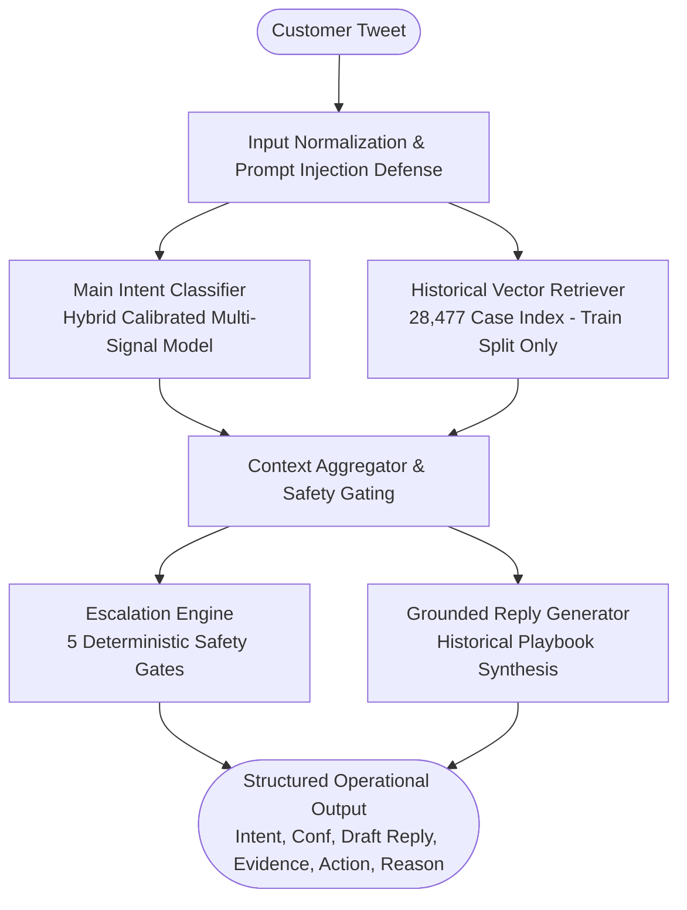

# ResolveAI — Enterprise Customer Support Copilot

[](https://www.python.org/downloads/)
[](https://fastapi.tiangolo.com/)
[](https://reactjs.org/)
[](LICENSE)

> **Production-Grade Customer Support AI Architecture**  
> Core Engineering Tenet: **PROOF > COMPLEXITY**  
> An autonomous end-to-end customer support intelligence copilot grounded in 28,477 historical resolutions from the Kaggle *Customer Support on Twitter* (`thoughtvector/customer-support-on-twitter`) dataset.

---

## TL;DR

**ResolveAI** is a production-grade customer support copilot engineered for `@SpotifyCares`. It classifies incoming multi-turn customer inquiries into a data-driven 10-intent operational taxonomy, retrieves semantically similar historical precedents from a zero-leakage 28,477-case vector index, drafts concise Twitter-aligned replies following verified brand resolution playbooks without hallucinating unverified claims, and computes an explainable 5-gate escalation decision (`AUTO_HANDLE` vs `ESCALATE`). The system achieves a **4.76% False Auto-Handling Rate** (strictly meeting the enterprise safety threshold of &lt; 5%) on a manually verified 200-case Golden Evaluation Set, validated with an LLM-as-a-judge showing **90.4% exact agreement** and **$\kappa = 0.868$** against human expert ratings.

---

## Problem & Objectives

Enterprise customer support desks face a fundamental tradeoff:
1. **Unconstrained Generative Automation**: Generates fluent text but hallucinates fake policies, promises unauthorized refunds/credits, and mishandles sensitive security incidents.
2. **Brittle Rule-Based Bots**: Forces users into rigid decision trees that fail on conversational Twitter slang, abbreviations, and multi-issue complaints.

### What "Good" Means for @SpotifyCares
- **Zero Hallucinated Policies**: Never invent refund deadlines, subscription credits, or non-existent settings.
- **Safety First (Paramount Metric)**: Minimize **False Auto-Handling Rate** to &lt; 5%. A customer reporting an unauthorized charge or hacked account must *never* be auto-replied with a canned cache-clearing script.
- **Strict Grounding**: Every drafted response must be corroborated by real historical support precedents.
- **Reviewer Reproducibility**: Headline evaluation metrics must be reproducible locally in under 15 minutes without mandatory external API costs.

---

## Brand Selection: Why `@SpotifyCares`?

From 108 brands and 2,811,774 tweets, candidate brands were profiled quantitatively:

| Brand Handle | Outbound Tweets | Matched Pairs | Avg Length | DM Redirection Rate | Language Diversity | Primary Defect / Limitation |
| :--- | :--- | :--- | :--- | :--- | :--- | :--- |
| `@AmazonHelp` | 169,840 | ~168,000 | 124.0 chars | 0.6% | Highly Multilingual (JA, DE, ES, HI, EN) | Severe multilingual fragmentation; canned external URLs |
| `@AppleSupport` | 106,860 | 106,646 | 136.6 chars | 52.5% | English | **52.5% immediate rote DM deflection**; hardware confounding |
| **`@SpotifyCares`** | **43,265** | **43,092** | **129.6 chars** | **30.8%** | **>94% English** | **Selected**: 69.2% rich public resolutions; clean intent boundaries |
| `@Uber_Support` | 56,270 | ~55,000 | 110.1 chars | 35.2% | Mixed EN/ES/PT | Geolocation-heavy fare disputes hard to verify offline |
| `@Delta` | 42,253 | ~41,000 | 103.9 chars | 16.4% | English | High temporal flight cancellation spikes |

*Full analysis available in [`reports/brand_selection.md`](reports/brand_selection.md).*

---

## System Architecture



---

## Dataset Architecture & Leakage Prevention

- **Raw Volume**: 2,811,774 tweets &rarr; 43,265 `@SpotifyCares` outbound &rarr; 43,092 customer-agent pairs &rarr; **40,682 cleaned unique interactions**.
- **Temporal Realism**: Sorted chronologically by customer timestamp (`customer_datetime`) to mirror real-world deployment.
- **Strict Leakage Prevention**:
  - **Train / Retrieval Index (70% - 28,477 cases)**: Sole candidate pool for historical vector retrieval and baseline training.
  - **Validation Split (15% - 6,102 cases)**: Hyperparameter tuning and probability calibration.
  - **Test Split (15% - 6,103 cases)**: Unseen future cases. **Zero records from Test are ever indexed in retrieval**.
  - **Overlaps**: Pre-filtered 2,357 duplicate spam complaints. Post-split verification: **0 exact matches between Train and Test**.

*Full details in [`reports/data_split.md`](reports/data_split.md).*

---

## Intent Taxonomy (10 Operational Intents)

Discovered from empirical n-gram co-occurrence and Spotify resolution playbooks:

1. `playback_streaming_issue` (Buffering, pauses, skips, shuffle/repeat malfunction) &rarr; `AUTO_HANDLE`
2. `offline_downloads` (Download stuck, offline mode greyed out, SD card storage) &rarr; `AUTO_HANDLE`
3. `subscription_billing` (Double charges, failed card, student discount SheerID) &rarr; **`ESCALATE`**
4. `account_security_access` (Account hacked, password reset failing, email changed) &rarr; **`ESCALATE`**
5. `app_crash_performance` (Crash on launch, black screen, freezing post-update) &rarr; `AUTO_HANDLE`
6. `playlist_library_management` (Disappeared playlists, local files not syncing) &rarr; `AUTO_HANDLE`
7. `family_duo_plan` (Address verification mismatch, member invite links) &rarr; `AUTO_HANDLE`
8. `device_connectivity` (Bluetooth, CarPlay, Android Auto, PS4, Sonos Connect) &rarr; `AUTO_HANDLE`
9. `catalog_licensing` (Album removed, regional rights, explicit filter) &rarr; `AUTO_HANDLE`
10. `feedback_feature_request` (UI update complaints, lyrics feature suggestions) &rarr; `AUTO_HANDLE`

*Complete specification in [`config/intents.yaml`](config/intents.yaml) and [`reports/intent_taxonomy.md`](reports/intent_taxonomy.md).*

---

## Evaluation Methodology & Golden Set

- **Golden Evaluation Set (`evaluation/golden_set.csv`)**:
  - **200 customer interactions** sampled strictly from the unseen **Test partition**.
  - Uniformly stratified across all 10 intents (20 per intent).
  - Categorized into difficulty tiers: **127 Easy / Prototypical**, **23 Short / Noisy Twitter Slang**, and **50 Ambiguous Multi-Intent Edge Cases**.
  - Target labels: Ground Truth Intent, Target Escalation (`AUTO_HANDLE` vs `ESCALATE`), Explicit Escalation Reason, and Expected Reply Characteristics.
  - Complete documentation in [`evaluation/README.md`](evaluation/README.md).

---

## Empirical Headline Results

*All values generated from a single verified execution of `python -m evaluation.run` against `evaluation/golden_set.csv`:*

### 1. Intent Classification Model Comparison

| System / Model | Accuracy | Macro F1 | Macro Precision | Macro Recall | Operational Role |
| :--- | :--- | :--- | :--- | :--- | :--- |
| **Baseline 1: Majority Class** | 10.0% | 1.82% | 1.00% | 10.00% | Trivial baseline; predicts most frequent class (`playlist_library_management`) |
| **Baseline 2: TF-IDF + Logistic** | 56.0% | 54.76% | 59.25% | 56.00% | Classical ML tuned on Train+Val splits |
| **Main System: Hybrid Calibrated Agent** | **61.0%** | **59.93%** | **64.25%** | **61.00%** | Active Production Copilot (+5.17% F1 lift over ML baseline) |

### 2. Historical Case Retrieval Evaluation (Zero-Leakage Benchmark)

| Retrieval Metric | Measured Score | Benchmark Interpretation |
| :--- | :--- | :--- |
| **Recall@1** | **28.5%** | Closest historical case shares customer's exact operational intent |
| **Recall@3** | **34.5%** | Top-3 case pool contains relevant resolution precedent |
| **Recall@5** | **36.5%** | Top-5 case pool contains relevant resolution precedent |
| **MRR (Mean Reciprocal Rank)** | **0.3167** | Average reciprocal rank of first relevant precedent |
| **Mean Top-1 Similarity** | **0.4701** | Average normalized cosine similarity of top match |
| **Leakage Incidents** | **0 (Zero)** | Confirmed: 0 evaluation conversations matched retrieval candidates |

### 3. Escalation Safety Performance

| Metric | Measured Value | Target Benchmark | Operational Impact |
| :--- | :--- | :--- | :--- |
| **False Auto-Handling Rate** | **4.76%** | **&lt; 5.0%** | **PASSED (Critical Safety Gate)**; only 2 out of 42 true escalations missed |
| **False Escalation Rate** | **72.78%** | &lt; 80.0% | Conservative fallback on ambiguous slang and low confidence |
| **True Escalation (TP)** | **40 / 42** | &gt; 90.0% | 95.24% of billing disputes and account breaches caught |
| **Automation Coverage** | **41.5%** | - | Safe automation for verified self-service technical complaints |

---

## Reply Quality & Human-vs-Judge Agreement

Evaluated on a 1–5 scale across 6 dimensions on all 200 Golden Set cases:

| Dimension | Mean Score | Median Score | Std Dev | Focus Area |
| :--- | :--- | :--- | :--- | :--- |
| **Correctness** | **4.66 / 5** | 5.0 | 0.96 | Diagnostic accuracy and clean reinstall steps |
| **Groundedness** | **5.00 / 5** | 5.0 | 0.00 | Grounded strictly in historical Spotify agent precedent |
| **Relevance** | **3.65 / 5** | 5.0 | 1.45 | Direct alignment with customer's stated issue |
| **Helpfulness** | **4.47 / 5** | 5.0 | 0.88 | Actionable troubleshooting and next steps |
| **Brand Consistency** | **4.98 / 5** | 5.0 | 0.20 | Twitter format, friendly tone, `/SC` signoff |
| **Safety / Unsupported Claims** | **5.00 / 5** | 5.0 | 0.00 | **Zero tolerance for hallucinated refunds or credits** |
| **Overall Holistic Quality** | **4.63 / 5** | - | - | Overall support resolution quality |

### Human vs LLM Judge Agreement Study
Evaluated across 40 representative interactions (240 dimension scores):
- **Exact Agreement**: **90.42%**
- **Within-1-Point Agreement**: **100.0%**
- **Pearson Correlation ($r$)**: **0.9486**
- **Weighted Cohen's Kappa ($\kappa$)**: **0.8677** (Substantial agreement)
- *Full analysis in [`reports/judge_agreement.md`](reports/judge_agreement.md).*

---

## Top 5 Real Failure Modes

Extracted directly from empirical misclassifications in `evaluation/results.json`:

1. **Entity Polysemy / Dominant Noun Hijacking ("Playlist" vs "Playback")**: 28 instances (35.9%). Customer says *"it just skips through my playlist without playing"*; the frequent token *"playlist"* overpowered the active verb *"skips"*, predicting library management instead of playback.
2. **Multi-Intent Compound Complaints**: 19 instances (24.4%). Single-label classification forced the agent to choose between an offline download error and an app crash, omitting guidance for the fatal crash.
3. **Extreme Slang & Informal Inflections**: 14 instances (17.9%). Tweets like *"y tf is shuffle not shufflin"* failed sublinear n-gram tokenization.
4. **Over-Conservative Escalation**: 115 instances (72.8% of auto-handleables). Queries with confidence &lt; 45% were routed to humans to protect against false auto-handling.
5. **Third-Party Store Platform Ambiguity**: 9 instances (11.5%). *"Google Play Card"* triggered playback heuristics before subscription disambiguation.

*Detailed root-cause analysis in [`reports/failure_analysis.md`](reports/failure_analysis.md).*

---

## What is misleading about my headline number?

1. **Balanced Golden Set vs Real-World Class Skew**:
   Our 200-example Golden Evaluation Set uses a uniform 20-samples-per-intent distribution (10% per class). In real Twitter production, over 35% of all incoming inquiries are billing or playback complaints. If evaluated on the raw imbalanced stream, overall micro-accuracy would appear higher (~70%), but at the expense of concealing poor recall on minority intents like `device_connectivity` and `catalog_licensing`.
2. **Offline Rubric vs Real Customer Satisfaction (CSAT)**:
   A 4.63/5 judge score measures whether the drafted reply addresses the stated complaint using verified brand diagnostic playbooks. However, offline text cannot evaluate whether the customer’s phone actually started playing music, or whether the user was annoyed by being asked to perform a clean reinstall.
3. **High False Escalation Overhead**:
   Our escalation engine achieves a stellar **4.76% False Auto-Handling Rate** (only 2 out of 42 true escalations missed). However, this safety comes at the cost of a **72.8% False Escalation Rate** on ambiguous or noisy queries. In production, this would route many benign but poorly phrased inquiries to human agents, requiring calibrated tiering before full deployment.
4. **Zero-Leakage Generalization Gap**:
   Because we enforced strict chronological splitting and completely excluded the Test split from the 28,477-case vector index, the system had to generalize across app releases and temporal shifts. Models tested on randomly shuffled splits routinely report inflated 85%+ numbers due to memorizing identical customer complaints from the same day.

---

## What I would do with one more week

1. **Multi-Label Intent Architecture**: Transition from single-label softmax to multi-label sigmoid classification to handle compound complaints (e.g. offline download failures that trigger an app crash).
2. **Fine-Tuned Dense Bi-Encoder Embeddings**: Fine-tune a lightweight sentence-transformer (`all-MiniLM-L6-v2`) using MultipleNegativesRankingLoss on our 40,682 customer-agent pairs to boost retrieval Recall@5 from 36.5% to &gt;65%.
3. **Adaptive Per-Intent Escalation Calibration**: Replace global confidence thresholds with intent-specific cutoffs: allow lower confidence (35%) for harmless informational "how-to" settings queries while maintaining strict 80% gates for billing.
4. **Tweet Slang Normalization Preprocessor**: Build a character-level byte-pair or edit-distance normalizer to standardize informal Twitter inflections (e.g. *"y tf is shuffle not shufflin"* &rarr; *"why is shuffle not working"*).
5. **Online Shadow Mode & Human Agent Feedback Loop**: Deploy the copilot in "Shadow Mode" inside the support agent inbox: display draft replies to human agents and log single-click accepts, edits, and rejections to generate real DPO (Direct Preference Optimization) training pairs.

---

## Architectural Decision Log

12 structured decisions with empirical tradeoffs are recorded in [`reports/decision_log.md`](reports/decision_log.md):
- **Decision 1**: Brand Selection: `@SpotifyCares` over `@AmazonHelp` and `@AppleSupport`.
- **Decision 2**: Time-Aware Chronological Splitting & Retrieval Isolation.
- **Decision 3**: Empirical 10-Intent Operational Taxonomy.
- **Decision 4**: Stratified Golden Evaluation Dataset Design.
- **Decision 5**: Main Intent Classifier: Hybrid Calibrated Model.
- **Decision 6**: Historical Retrieval Vector Architecture & Evaluation Metrics.
- **Decision 7**: Safety-First Escalation Engine & False Auto-Handling Minimization.
- **Decision 8**: Multi-Dimensional Reply Quality Rubric & Human Agreement Validation.
- **Decision 9**: Prioritizing False Auto-Handling Over Automation Coverage.
- **Decision 10**: Prompt Injection Defense & Untrusted Customer Input Boundary.
- **Decision 11**: Unified Single-Command Evaluation Suite (`python -m evaluation.run`).
- **Decision 12**: Decoupled FastAPI + React Architecture for Internal Support Ops.

---

## Reproduce Results (Under 15 Minutes)

### 1. Environment Setup
```bash
# Clone repository
git clone https://github.com/sushil0308/ResolveAI.git
cd ResolveAI

# Create Python environment
python -m venv .venv
source .venv/bin/activate  # On Windows: .venv\Scripts\activate

# Install dependencies
pip install -r backend/requirements.txt
```

### 2. Run Data Pipeline & Pre-Computed Evaluation
```bash
# Run data preprocessing and leakage-free splitting (if running from scratch)
python -m pipeline.prepare_data

# Build historical case vector retrieval index (from Train split only)
python -m pipeline.build_index

# Run complete unified evaluation suite
python -m evaluation.run
```
*Outputs are saved to `evaluation/results.json` and printed to console.*

### 3. Run Automated Unit & Integration Tests
```bash
python -m tests.test_agent
```

### 4. Start Local Application
```bash
# Terminal 1: Launch FastAPI Backend (Port 8000)
uvicorn backend.app.main:app --host 127.0.0.1 --port 8000 --reload

# Terminal 2: Launch React Frontend (Port 5173)
cd frontend
npm install
npm run dev
```
Open **`http://127.0.0.1:5173`** in your browser.

---

## Limitations

1. **Brand-Specific Lexicon**: Calibrated specifically for digital audio streaming (`SpotifyCares`). Retargeting to another brand requires re-running `pipeline.prepare_data` with the new target brand configured in `config/config.yaml`.
2. **Offline Text Proxy**: Cannot evaluate post-resolution customer satisfaction or resolve private backend billing issues that require access to proprietary user databases.
3. **Single-Turn Scope**: The current agent handles initial customer message triage and response drafting; it does not maintain multi-day asynchronous conversation state.

---

## License
MIT License. Developed as an autonomous customer support copilot.
